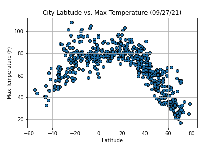
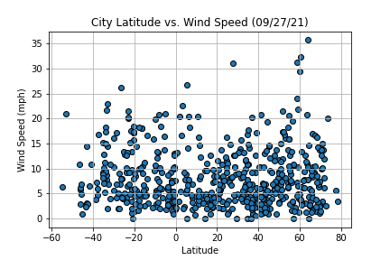

# python-api-challenge
Repo for python api challenge

<h3>Part I - WeatherPy</h3>

<h4>Observations</h4>

<ul>
    <li>one</li>
    <li>two</li>
    <li>three</li>
</ul>

Latitude vs. Max Temperature

Latitude vs. Humidity

Latitude vs. Cloudiness

Latitude vs. Wind Speed
